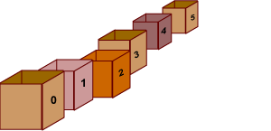

# Ruby Variables, Types, and Methods

## Students Will Be Able To:

- [ ] assign names to values with variables
- [ ] create numbers
- [ ] use the basic number operators - `+`, `-`, `*`, `/`
- [ ] distinguish strings from code
- [ ] use basic string methods, `+`, `.length`, `.downcase`, `.upcase`
- [ ] create arrays, add elements, and access them
- [ ] recognize `nil` values
- [ ] define methods with `def`

## Variables

When we're writing a program, think of it like creating a little universe. The "things" in the universe is the _literal data_ that we care about (like text, numbers, etc). We can use _variables_ to name the "things" (data) we care about. The computer is helping us to create this universe so we need a way to communicate with it; when I say `name = "Ian"` and then ask my computer for `name` it knows where to look to find that.

- When we use `""` to create a string, or mention a number like `5`, we are using it _literally_
- We don't always know what the value is going to be when we are writing the program - we need a way to refer to data without using the literal value
- We can use _variables_! 
- An analogy for thinking about variables: Think of a box. Inside that box, you put one single thing inside. On the outside of that box, you write what's inside of it. You can think of whatever is inside the box as the value and you can think of the label as the variable! 
- In ruby, we can assign a label to a value like `name = "Ian"` or `number = 6`
- Then, when we mention `name` or `number` later, we get the value out!

```ruby
> name = "Ian"
=> "Ian"
> name
=> "Ian"
> number = 6
=> 6
> number
6
```


## Types: Strings, Numbers, Arrays

- When we are programming, our values have different _types_
- We want to do different operations depending on what kind of data something is
- If it's a number, we want to do "math-y" things with it
- If it's text, we want to do "text-y" things with it
- We're going to focus on Numbers, Strings, and Arrays

### Numbers

- We can create a number in ruby by typing the number - `5` or `-100` or `61342`
- Ruby also knows how to do math
- We can use operations like `+` and `*` and `-` and `/`

```ruby
> 5 + 5
=> 10
> 3 * 4
=> 12
> 9 - 8
=> 1
> 100 / 10
> 10
```

- Ruby also knows some more fancy operators!

- `**` for exponents:

```ruby
> 6 ** 2
=> 36
> 8 ** 2
=> 64
> 3 ** 3
=> 27
```

What other operators can you find? Try looking up more ruby number operators with Google and the Ruby docs!

There are a couple different 'types' of numbers in Ruby: Integers (whole numbers) and Floats (decimal numbers).

```rb
> 5 / 2
=> 2
> 5 / 2.0
=> 2.5
```

You can coerce numbers from one type to another with `.to_i` (convert to integer) or `.to_f` (convert to float). Let's say we're writing a program to keep track of how much Halloween candy we have and want to know the average amount:

```rb
house1_candies = 5
house2_candies = 2
house3_candies = 1

houses_visited = 3
total_candies = house1_candies + house2_candies + house3_candies

average_candies_per_house = total_candies / houses_visited.to_f
```

### Strings
- In order to distinguish the _text we want to print_ from the _code that we want to execute_, we wrap our words in `"quote marks"`.
- In ruby, these _things in quotes_ are called **Strings**
- What kinds of operations can we do on Strings?

`+` adds strings together:

```ruby
> "cat" + "dog"
=> "catdog"
> "I'm going to the" + " store " + " to buy " + " some groceries " + "."
```

You can also use a special syntax with double-quoted strings that will let you _interpolate_ variables into strings:

```rb
name = "Ian"
fave_candy = "peanut m&ms"

puts "Hi my name is " + name + " and I love " + fave_candy
puts "Hi my name is #{name} and I love #{fave_candy}"
```

Inside of the string, any variables inside of the "#{}" will be evaluated and inserted into the string. This is helpful for putting together complex strings instead of relying on concatenation with `+`.

`.length` reports on the string's length:

```ruby
> name.length
=> 3
> fave_candy.length
=> 11
```

`.upcase` creates an UPPERCASE version of the string
```ruby
> "shouting".upcase
=> "SHOUTING"
```

Similarly, `.downcase` returns a lowercase version

```ruby
> "ALAKAZAM!".downcase
=> "alakazam!"
```

What do you think will happen if we _multiply_ a string and a number?

```rb
> "hi" * 5
=> "hihihihihi"
```

There are lots of other string methods! Browse the ruby docs to see more.

### Arrays 

An array is a data structure meaning it is a structure that holds data! An array is a collection of data.

An analogy - You can think of an array as a row of boxes! Each box contains one single thing and on the outside of each box is a number to identify the box's position. In computer science, we start counting from 0 instead of 1. So the first box will be labeled `0`, the second box will be labeled `1`, etc. Assigning a variable name to an array would be like giving a name to identify the whole row of boxes.



- Arrays are lists of values
- We use `[]` to create arrays

```ruby
> array = [1,2,3]
=> [1,2,3]
```

- We can add new values to the array with the `<<` "shovel" method

```ruby
> array << 4
=> [1,2,3,4]
```

- We can get an item out of the array ('access' it) with `[]`

```ruby
> array[0]
=> 1
> array[1]
=> 2
```

- Notice that array indices start at `0` - the first element is the 0th element, the second element has index `1`, etc.

- Arrays are useful for storing an _ordered collection_ of data. For example, we could use an array to write the candy example from before more elegantly:

```rb
house_candies = [5, 2, 1]

total_candies = house_candies[0] + house_candies[1] + house_candies[2]
# or house_candies.sum
houses_visited = house_candies.length

average_candies_per_house = total_candies / houses_visited.to_f
```

### Nil
- Sometimes we want to represent that 'nothing is there'
- We use a special value `nil` to mean 'nothing'

```ruby
> nil
=> nil
> array = [1,2,3]
> array[0]
=> 1
> array[99]
=> nil
```

It'll pop up, so that's what it means when you see it.

## Methods

- Typing everything that happens every time is annoying
- DRY - don't repeat yourself!
- Instead of copying and pasting, lets write a method!
- A _method_ in ruby is a set of instructions that we can run later (the word _function_ is used interchangeably)
- we create a method with: 

```ruby
# Define a method
def spooky_greeting
  # body of method
  greeting = "🎃 Trick or Treat, Isabel 🎃"

  puts "🎃" * greeting.length
  puts greeting
  puts "🎃" * greeting.length
end
```

- We run the method ("call" or "invoke" the method) by calling its name (with or without parentheses - Ruby is flexible!)

```ruby
spooky_greeting()
# or
spooky_greeting
```

## Arguments

- We want to be able to customize our methods
- Methods can take input
- We declare what _arguments_ a method takes when we define the method
- We can refer to those arguments in the body of the method, and customize what the method does

```ruby
def spooky_greeting(name)
  greeting = "🎃 Trick or Treat, #{name} 🎃"

  puts "🎃" * greeting.length
  puts greeting
  puts "🎃" * greeting.length
end
```

- Then we "pass in" values when we call the method

```ruby
spooky_greeting("Isabel")
spooky_greeting("Ian")
```

If we want methods to accept more than one argument, we mention multiple arguments when we define the method:

```ruby
def print_product(first, second)
  puts first * second
end

print_product(6, 7)
```

The order of the values that we pass in is important! Each argument will get 'matched up' with the argument in that position in the method's definition.

```ruby
def print_in_order(name_one, name_two, name_three, name_four)
  puts "Hello " + name_one
  puts "Welcome " + name_two
  puts "Hi " + name_three
  puts "Greetings, " + name_four
end

print_in_order("Hillary", "Jake", "Ann", "Rob")
```

If we pass in the values in a different order, the values will be assigned to different names in the body of the method

```ruby
print_in_order("Rob", "Hillary", "Jake", "Ann")
print_in_order("Ann", "Rob", "Hillary", "Jake")
```

